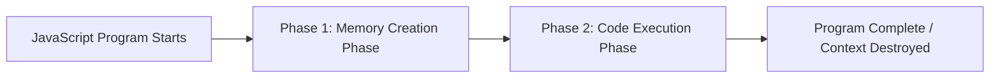

# Global Execution Context (GEC) & Call Stack in JavaScript

Everything in JavaScript happens inside an **Execution Context**.

JavaScript is a **synchronous, single-threaded language** — it can only execute one command at a time in a specific, sequential order.

---

## 📌 Master Table of Contents
1. [What is an Execution Context?](#1-what-is-an-execution-context)
2. [Anatomy of an Execution Context](#2-anatomy-of-an-execution-context)
3. [The Global Execution Context (GEC)](#3-the-global-execution-context-gec)
4. [The Two Phases of Execution](#4-the-two-phases-of-execution)
   - [Phase 1: Memory Creation Phase](#phase-1-memory-creation-phase-creation--hoisting)
   - [Phase 2: Code Execution Phase](#phase-2-code-execution-phase-thread-of-execution)
5. [Complete Step-by-Step Visual Walkthrough](#5-complete-step-by-step-visual-walkthrough)
6. [Function Execution Context (FEC)](#6-function-execution-context-fec)
7. [The Call Stack (Execution Context Stack)](#7-the-call-stack-execution-context-stack)
8. [`var` vs `let`/`const` in the Global Context (TDZ)](#8-var-vs-letconst-in-the-global-context-tdz)
9. [Quick Summary Cheatsheet](#9-quick-summary-cheatsheet)

---

## 1. What is an Execution Context?

An **Execution Context** is like a big box or container where JavaScript code is evaluated and executed. It manages the environment, scope, variables, functions, and the `this` binding for the code currently running.

```text
┌──────────────────────────────────────────────────────────────┐
│                      EXECUTION CONTEXT                       │
│                                                              │
│  ┌─────────────────────────────┬──────────────────────────┐  │
│  │      MEMORY COMPONENT       │      CODE COMPONENT      │  │
│  │   (Variable Environment)    │   (Thread of Execution)  │  │
│  ├─────────────────────────────┼──────────────────────────┤  │
│  │ key : value                 │ Executes code line-      │  │
│  │ a   : 10                    │ by-line synchronously    │  │
│  │ fn  : {...code...}          │                          │  │
│  └─────────────────────────────┴──────────────────────────┘  │
└──────────────────────────────────────────────────────────────┘
```

---

## 2. Anatomy of an Execution Context

Every Execution Context consists of two vital parts:

### 1. Memory Component (Variable Environment)
- This is where **variables and functions are stored as key-value pairs** before any code is executed.
- Example: `a : undefined`, `greet : function() { ... }`.

### 2. Code Component (Thread of Execution)
- This is the place where JavaScript code is **executed line-by-line**, from top to bottom.

---

## 3. The Global Execution Context (GEC)

When you run any JavaScript file (even an empty one), the JavaScript Engine automatically performs two setup actions:
1. It creates the **Global Execution Context (GEC)**.
2. It creates a **Global Object**:
   - In Browsers: `window`
   - In Node.js: `global`
3. It creates the special keyword variable **`this`**, which at the global level points directly to the Global Object (`this === window`).

```javascript
// In Browser Console:
console.log(this);         // Window { ... }
console.log(window);       // Window { ... }
console.log(this === window); // true
```

---

## 4. The Two Phases of Execution

Whenever JavaScript runs an execution context, it runs in **two distinct phases**:



---

### Phase 1: Memory Creation Phase (Creation / Hoisting)
- The JS engine scans through the code from top to bottom.
- **No code is executed** during this phase.
- Memory is allocated for every variable and function declaration:
  - Variables declared with **`var`** are allocated memory and initialized with **`undefined`**.
  - **Functions declarations** are allocated memory and their **entire function body / code** is copied into memory!
  - Variables declared with **`let` and `const`** are allocated memory, but kept uninitialized in the **Temporal Dead Zone (TDZ)**.

---

### Phase 2: Code Execution Phase (Thread of Execution)
- The JS engine starts traversing the code again from top to bottom, but this time **executes the code line-by-line**.
- It performs actual variable assignments, math operations, and function invocations:
  - `var n = 2;` $\rightarrow$ Replaces `undefined` in memory with `2`.
  - When a function is called $\rightarrow$ A brand new **Function Execution Context (FEC)** is created!

---

## 5. Complete Step-by-Step Visual Walkthrough

Consider this classic JavaScript code snippet:

```javascript
var n = 2;

function square(num) {
    var ans = num * num;
    return ans;
}

var square2 = square(n);
var square4 = square(4);
```

Let's trace how the JavaScript Engine processes this:

---

### Step 1: Memory Creation Phase (GEC)

The JS engine scans the file and populates the Memory Component:

```text
┌──────────────────────────────────────────────────────────────┐
│                 GLOBAL EXECUTION CONTEXT (GEC)               │
│                                                              │
│  MEMORY COMPONENT                  CODE COMPONENT            │
│  ────────────────                  ──────────────            │
│  n       : undefined                                         │
│  square  : function square(num){..}                          │
│  square2 : undefined                                         │
│  square4 : undefined                                         │
└──────────────────────────────────────────────────────────────┘
```

---

### Step 2: Code Execution Phase (GEC)

Now the engine begins running code line-by-line:

#### Line 1: `var n = 2;`
- Value `2` is placed into `n` in memory: `n : 2`.

#### Lines 3–6: `function square(num) { ... }`
- Nothing to execute here because it is just a function definition (already stored in memory during Phase 1). The engine skips to line 8.

#### Line 8: `var square2 = square(n);`
- This is a **function invocation (call)**!
- Every time a function is called, JavaScript creates a **brand-new Function Execution Context (FEC)**!

```text
┌────────────────────────────────────────────────────────────────────────┐
│                     GLOBAL EXECUTION CONTEXT (GEC)                     │
│                                                                        │
│  MEMORY COMPONENT                      CODE COMPONENT                  │
│  ────────────────                      ──────────────                  │
│  n       : 2                           square2 = [waiting for square()]│
│  square  : {...}                                                       │
│  square2 : undefined                                                   │
│  square4 : undefined                                                   │
│                                                                        │
│        ┌──────────────────────────────────────────────────┐            │
│        │        FUNCTION EXECUTION CONTEXT (for square2)  │            │
│        │                                                  │            │
│        │  MEMORY COMPONENT            CODE COMPONENT      │            │
│        │  ────────────────            ──────────────      │            │
│        │  num : 2                     ans = 2 * 2 = 4     │            │
│        │  ans : undefined -> 4        return ans (4)      │            │
│        └──────────────────────────────────────────────────┘            │
└────────────────────────────────────────────────────────────────────────┘
```

Inside this new Function Execution Context:
1. **Phase 1 (Memory)**:
   - Parameter `num` is allocated memory and gets argument `2`.
   - Local variable `ans` is initialized to `undefined`.
2. **Phase 2 (Code Execution)**:
   - `ans = num * num` $\rightarrow$ `ans = 2 * 2 = 4`.
   - `return ans;` $\rightarrow$ Returns `4` back to the GEC where the function was called.
3. Once the return statement executes, **this Function Execution Context is completely destroyed and erased from memory!**
4. In GEC: `square2` updates from `undefined` to `4`.

---

#### Line 9: `var square4 = square(4);`
- Another function call $\rightarrow$ Creates **another new Function Execution Context**!
- Memory phase: `num: 4`, `ans: undefined`.
- Execution phase: `ans = 4 * 4 = 16`, returns `16`.
- FEC is destroyed.
- In GEC: `square4` updates to `16`.

#### End of Program:
Once all lines finish executing, the **Global Execution Context itself is deleted!**

---

## 6. Function Execution Context (FEC)

A **Function Execution Context** is created whenever a function is invoked.

Key Differences from GEC:
- GEC is created **once** when the script starts.
- FEC is created **every time** a function is called.
- FEC contains:
  - Its own **local Memory Component** (parameters, local variables).
  - Its own **Code Component**.
  - A reference to its **Outer Lexical Environment** (Scope Chain).

---

## 7. The Call Stack (Execution Context Stack)

How does JavaScript keep track of all these nested execution contexts?  
Through the **Call Stack**!

The **Call Stack** is a data structure (LIFO: Last In, First Out) that manages the execution contexts during code execution.

```text
CALL STACK TRANSITIONS:

     Empty          GEC Pushed       FEC (square2)      FEC Completed      FEC (square4)      FEC Completed       Program Done
   ┌───────┐       ┌───────────┐     ┌───────────┐      ┌───────────┐      ┌───────────┐      ┌───────────┐       ┌───────┐
   │       │       │           │     │FEC:square2│      │           │      │FEC:square4│      │           │       │       │
   │       │  ──>  │           │ ──> ├───────────┤ ──>  │           │ ──>  ├───────────┤ ──>  │           │  ──>  │       │
   │       │       │    GEC    │     │    GEC    │      │    GEC    │      │    GEC    │      │    GEC    │       │       │
   └───────┘       └───────────┘     └───────────┘      └───────────┘      └───────────┘      └───────────┘       └───────┘
    Start            Line 1-7           Line 8            Return 4           Line 9             Return 16           End
```

### Call Stack Lifecycle:
1. At the very beginning, the **GEC is pushed** to the bottom of the Call Stack.
2. When `square(n)` is called, **FEC (square2) is pushed** on top of the GEC.
3. When `square` returns `4`, **FEC (square2) is popped off** the stack.
4. When `square(4)` is called, **FEC (square4) is pushed** on top.
5. When `square` returns `16`, **FEC (square4) is popped off**.
6. When the entire script finishes, **GEC is popped off**, and the Call Stack is empty.

### Other Names for Call Stack:
- **Execution Context Stack**
- **Program Stack**
- **Control Stack**
- **Runtime Stack**
- **Machine Stack**

---

## 8. `var` vs `let`/`const` in the Global Context (TDZ)

When GEC creates memory:
- **`var`** is attached to the **Global Object (`window`)**.
- **`let` and `const`** are stored in a separate memory space called **Script Scope** (or Declarative Environment Record).
- They exist in the **Temporal Dead Zone (TDZ)** from the start of the block until the line they are declared.

```javascript
console.log(a); // undefined (hoisted with undefined)
// console.log(b); // ReferenceError: Cannot access 'b' before initialization (in TDZ)

var a = 10;
let b = 20;

console.log(window.a); // 10 (attached to global window)
console.log(window.b); // undefined (NOT attached to window)
```

---

## 9. Quick Summary Cheatsheet

| Concept | What It Is / Does |
|---|---|
| **Execution Context** | The environment where JavaScript code is evaluated and executed |
| **GEC** | Global Execution Context — created once when the program starts |
| **FEC** | Function Execution Context — created every time a function is called |
| **Phase 1: Memory Phase** | Allocates memory; `var` gets `undefined`, functions get their full body |
| **Phase 2: Code Phase** | Executes code line-by-line; assigns values, executes logic |
| **Call Stack** | LIFO stack that manages the active execution contexts |
| **`this` in Global Context** | Points directly to the global object (`window` in browser) |
| **Hoisting** | Phenomenon where variables and functions can be accessed before declaration due to Phase 1 memory allocation |
